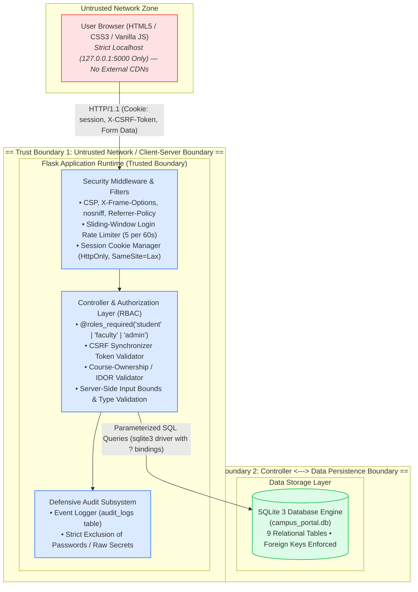
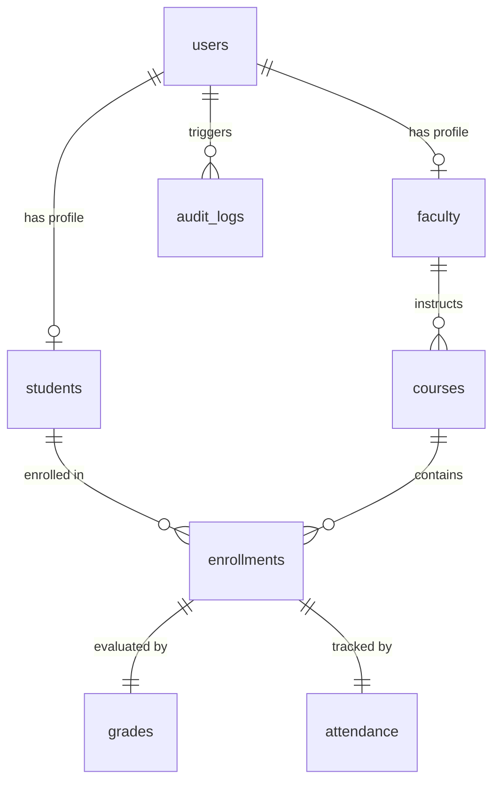
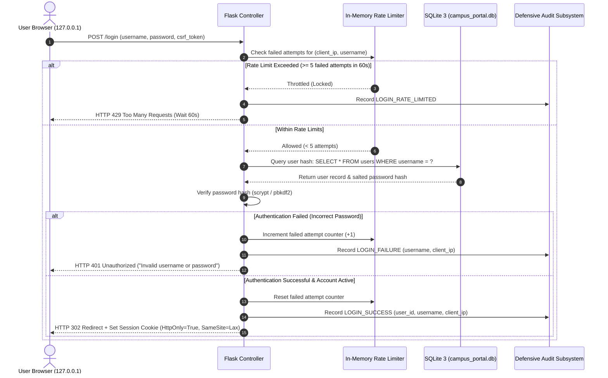
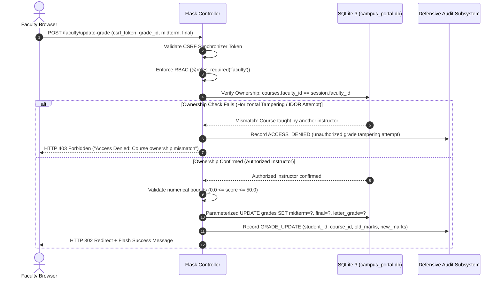

# CampusPortal - System Architecture & Trust Boundaries

> **Authorized Local Defensive Lab**  
> **Environment:** Localhost Isolated Environment (`127.0.0.1:5000`)  
> **Target:** Defensive Cybersecurity Threat-Modeling & Architecture Review

---

## 1. System Overview

**CampusPortal** is a monolithic server-side rendered (SSR) web application engineered in Python 3 using the Flask micro-framework and an embedded SQLite 3 database. It simulates an institutional student information system (SIS) enabling role-based management of academic records, grades, attendance, and administrative user provisioning.

The entire architecture is intentionally compact and self-contained to facilitate rigorous threat modeling and security inspection within a 45–60 minute window.

---

## 2. Core Components & Subsystems

### 2.1 User Principals & Roles

| Principal | Role Identifier | Privilege Level | Permitted Operations |
| :--- | :--- | :--- | :--- |
| **Student** | `student` | Level 1 (Least Privilege) | View personal dashboard, courses, grades, attendance, announcements; edit non-sensitive profile attributes (email, phone, department, semester). |
| **Faculty** | `faculty` | Level 2 (Academic Staff) | View assigned course sections, view rosters of enrolled students, enter and update numerical scores (midterm, final) for assigned courses only. |
| **Administrator** | `admin` | Level 3 (Superuser) | Provision synthetic student/faculty accounts, activate/deactivate accounts, view all system accounts, inspect complete defensive audit trail. |

### 2.2 Web Application & Routing Layer (`app.py`)

- **Routing Dispatcher:** Maps HTTP endpoints (`/student/*`, `/faculty/*`, `/admin/*`) to controller handlers.
- **Template Engine:** Jinja2 renders HTML with strict context-variable autoescaping enabled by default, mitigating cross-site scripting (XSS).
- **Security Headers Filter (`@app.after_request`):** Enforces defence-in-depth headers on every HTTP response:
  - `Content-Security-Policy`: Restricts scripts, styles, and assets strictly to `'self'`.
  - `X-Frame-Options: DENY`: Prevents UI redressing and clickjacking.
  - `X-Content-Type-Options: nosniff`: Prevents MIME-confusion attacks.
  - `Referrer-Policy: strict-origin-when-cross-origin`: Minimizes referrer leakage.
  - `Cache-Control: no-store, no-cache, private`: Ensures authenticated records are not cached by intermediate proxies or browser history.
- **Generic Error Handlers:** Traps HTTP 400, 403, 404, and 500 errors to prevent Python traceback disclosure.

### 2.3 Authentication & Session Subsystem (`security.py`, `config.py`)

- **Password Storage:** Uses Werkzeug's implementation of salted adaptive cryptographic hashing (`scrypt` / `pbkdf2:sha256`). Plaintext passwords never persist.
- **Session State:** Managed through cryptographically signed client cookies (`flask.session`).
  - `HttpOnly = True`: Cookie cannot be read or exfiltrated via JavaScript `document.cookie`.
  - `SameSite = 'Lax'`: Cookie is withheld on cross-site requests, defending against cross-site request forgery.
  - `Lifetime = 1800s`: Sessions expire after 30 minutes of inactivity.
  - `Session Regeneration`: The session dictionary is explicitly cleared and re-keyed upon successful login, eliminating session fixation vulnerabilities.
- **Brute-Force Throttling:** An in-memory sliding window tracks failed authentication attempts per `(client_ip, username)`. If 5 failures occur within 60 seconds, further attempts receive HTTP `429 Too Many Requests`.

### 2.4 Data Persistence & Schema (`database.py`)

The application interfaces directly with SQLite 3 using parameterized SQL statements (`?` parameters). Foreign key constraints (`PRAGMA foreign_keys = ON`) are enforced.

1. **`users`**: Base credentials table (`id`, `username`, `password_hash`, `role`, `is_active`, `created_at`, `last_login`).
2. **`students`**: Student demographics (`id`, `user_id`, `student_id_code`, `full_name`, `email`, `phone`, `department`, `semester`).
3. **`faculty`**: Instructor demographics (`id`, `user_id`, `faculty_id_code`, `full_name`, `email`, `phone`, `department`).
4. **`courses`**: Course catalog (`id`, `course_code`, `title`, `department`, `credits`, `faculty_id`).
5. **`enrollments`**: Junction table (`id`, `student_id`, `course_id`, `enrollment_date`).
6. **`grades`**: Academic marks (`id`, `enrollment_id`, `midterm_score`, `final_score`, `total_score`, `letter_grade`, `updated_by_faculty_id`, `updated_at`).
7. **`attendance`**: Class participation (`id`, `enrollment_id`, `total_classes`, `attended_classes`, `percentage`, `updated_at`).
8. **`announcements`**: System bulletins (`id`, `title`, `content`, `author_role`, `created_at`).
9. **`audit_logs`**: Security telemetry (`id`, `timestamp`, `event_type`, `user_id`, `username`, `ip_address`, `status`, `details`).

---

## 3. Trust Boundaries

### Trust Boundary 1: Client Web Browser <---> Flask Application Server
- **Boundary Location:** HTTP interface (`127.0.0.1:5000`).
- **Threat Vector:** Malicious HTTP requests, tampered form parameters, stolen session tokens, CSRF attempts, XSS payloads.
- **Defensive Mechanism:** Session signatures, CSRF synchronizer tokens, CSP headers, rate-limiting, and server-side input validation.

### Trust Boundary 2: Flask Application Server <---> SQLite Database File
- **Boundary Location:** Python database driver interface.
- **Threat Vector:** SQL injection (SQLi) resulting in authentication bypass, data exfiltration, or table dropping.
- **Defensive Mechanism:** 100% parameterized queries. No dynamic string concatenation or f-strings in SQL execution.

### Trust Boundary 3: Role Separation & Horizontal Authorization Boundaries
- **Boundary Location:** Controller dispatch points.
- **Threat Vector:**
  - *Vertical Escalation:* A student accessing `/admin/users` or `/faculty/grades`.
  - *Horizontal Escalation (IDOR):* Student A viewing/editing Student B's grades, or Faculty A modifying marks in Faculty B's assigned course.
- **Defensive Mechanism:** `@roles_required` decorator checks active DB role, and course-ownership SQL checks verify `courses.faculty_id == session.faculty_id`.

---

## 4. Key Data Flows

### 4.1 Authentication & Session Initiation Flow

### 4.2 Faculty Grade Modification Flow (IDOR Defense)

---

## 5. External Dependencies Review

In accordance with strict cybersecurity lab isolation requirements:
- **External Network Calls:** **ZERO**. The application makes no outbound HTTP, DNS, or socket calls.
- **Third-Party CDNs:** **ZERO**. Bootstrap, Tailwind, FontAwesome, Google Fonts, and external JS libraries have been completely omitted in favor of self-contained local CSS and vanilla JS.
- **Package Footprint:** Dependent exclusively on Python 3 standard library and `flask` / `werkzeug`.
