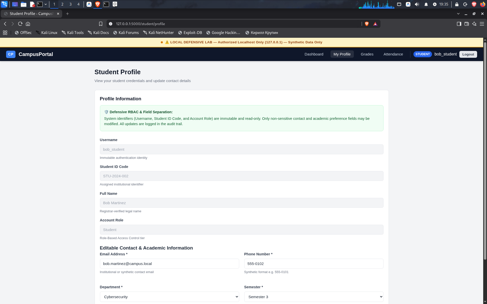
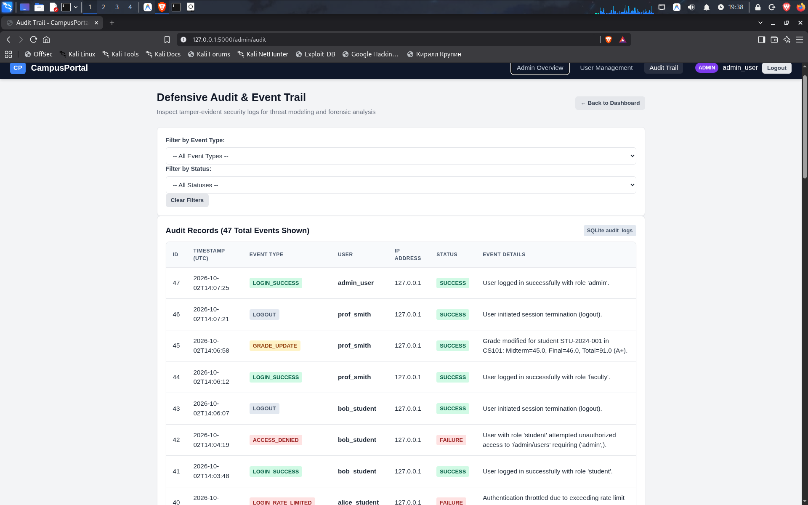
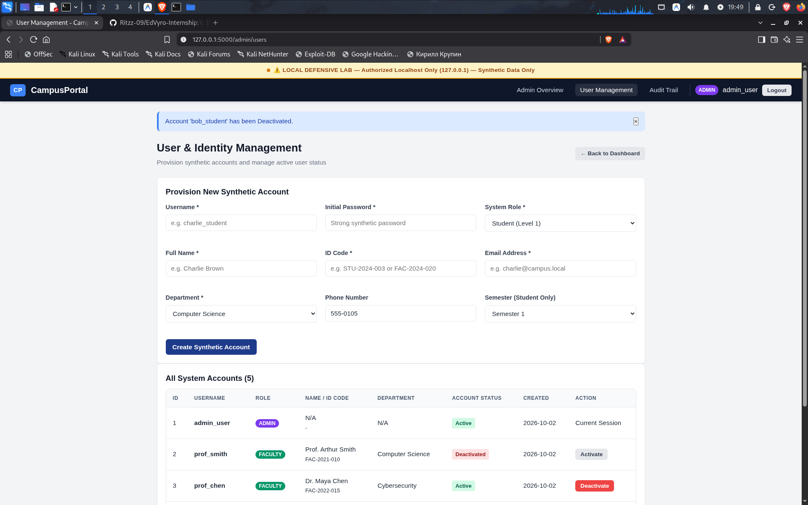

# CampusPortal - Cybersecurity Evidence Collection Guide

> **Purpose:** Photographic and technical evidence collected from the CampusPortal local defensive lab for academic evaluation and cybersecurity threat-modeling submission.

---

## Evidence Checklist Summary

| Evidence ID | Category | Target Interface / Test | Screenshot Asset | Objective |
| :---: | :--- | :--- | :--- | :--- |
| **EV-01** | Authentication & Rate Limiting | `/login` form & HTTP 429 response | [`Screenshot_2026-10-02_13_41_01.png`](documentation/Screenshot_2026-10-02_13_41_01.png) [`Screenshot_2026-10-02_13_42_26.png`](documentation/Screenshot_2026-10-02_13_42_26.png) | Show secure sign-in, demo credentials, and brute-force throttling |
| **EV-02** | Role Separation (RBAC) | 403 Forbidden page on unauthorized access | [`Screenshot_2026-10-02_19_34_27.png`](documentation/Screenshot_2026-10-02_19_34_27.png) | Prove student cannot access `/faculty/*` or `/admin/*` |
| **EV-03** | Student Portal Views | `/student/profile` | [`Screenshot_2026-10-02_19_35_04.png`](documentation/Screenshot_2026-10-02_19_35_04.png) | Demonstrate student data presentation and non-sensitive profile editing |
| **EV-04** | Faculty Grade Management | `/faculty/grades` & score update | [`Screenshot_2026-10-02_19_37_10.png`](documentation/Screenshot_2026-10-02_19_37_10.png) | Demonstrate roster display, marks entry, and IDOR protection |
| **EV-05** | Forensic Audit Trail | `/admin/audit` with filter controls | [`Screenshot_2026-10-02_19_38_03.png`](documentation/Screenshot_2026-10-02_19_38_03.png) | Demonstrate tamper-evident logging of security events without passwords |
| **EV-06** | User Lifecycle & Deactivation | `/admin/users` & deactivation lockout | [`Screenshot_2026-10-02_19_49_27.png`](documentation/Screenshot_2026-10-02_19_49_27.png) [`Screenshot_2026-10-02_19_49_34.png`](documentation/Screenshot_2026-10-02_19_49_34.png) | Demonstrate administrative account deactivation and login prevention |
| **EV-07** | Automated Test Verification | Terminal Unit Tests (18 Checks) | [`Screenshot_2026-10-02_19_38_46.png`](documentation/Screenshot_2026-10-02_19_38_46.png) | Prove CSP, X-Frame-Options, HttpOnly cookies, and 100% test pass rate |

---

## 1. Evidence Item EV-01: Authentication & Rate Limiting

### 1.1 Login Page & Defensive Banner
* **Target:** `http://127.0.0.1:5000/login`
* **Observation:** The login page displays the mandatory yellow header banner `⚠️ LOCAL DEFENSIVE LAB — Authorized Localhost Only (127.0.0.1) — Synthetic Data Only`, synthetic demo credentials for student, faculty, and admin accounts, and defensive notices (Werkzeug password hashing, rate limiting, audit logging, session cookie hardening).

### 1.2 Brute-Force Throttling in Action (HTTP 429)
* **Target:** `http://127.0.0.1:5000/login`
* **Observation:** After 5 consecutive invalid authentication attempts, the sliding-window rate limiter throttles further attempts, returning an HTTP 429 response and the defensive warning:
  > *"Too many failed login attempts. Please wait 60 seconds before trying again."*

---

## 2. Evidence Item EV-02: Role Separation & Access Control (RBAC)

### 2.1 Vertical Escalation Blocked (403 Forbidden)
* **Target:** `http://127.0.0.1:5000/admin/users` (accessed while authenticated as `bob_student`)
* **Observation:** The server-side `@roles_required('admin')` decorator detects unauthorized access by a student principal, immediately issues an HTTP 403 Forbidden response, renders a sanitized error template, and records an `ACCESS_DENIED` event in the database audit log.

---

## 3. Evidence Item EV-03: Student Profile & Boundary Protection

### 3.1 Field-Level Separation on Student Profile
* **Target:** `http://127.0.0.1:5000/student/profile`
* **Observation:** System identifiers (Username, Student ID Code, Account Role, Full Name) are locked and read-only. Only non-sensitive contact fields (Email, Phone, Department, Semester) are editable, and input validation strictly sanitizes all inputs.

---

## 4. Evidence Item EV-04: Faculty Grade & Performance Management

### 4.1 Marks Modification & Recalculation
* **Target:** `http://127.0.0.1:5000/faculty/grades?course_id=1`
* **Observation:** Instructor `prof_smith` manages course section `CS101 (Intro to Secure Programming)`. Updating Alice Vance's midterm score to `45.0` automatically recalculates total score (`91.0`), recomputes letter grade (`A+`), displays a success alert, and records a `GRADE_UPDATE` audit event for non-repudiation.

---

## 5. Evidence Item EV-05: Forensic Audit Trail Inspection

### 5.1 Security Event Logging & Non-Repudiation
* **Target:** `http://127.0.0.1:5000/admin/audit`
* **Observation:** The administrative audit log viewer provides an unalterable chronological record of security-relevant events (`LOGIN_SUCCESS`, `LOGIN_FAILURE`, `LOGIN_RATE_LIMITED`, `ACCESS_DENIED`, `GRADE_UPDATE`). Passwords and auth tokens are strictly excluded from event details to prevent credential leakage.

---

## 6. Evidence Item EV-06: User Lifecycle & Account Deactivation

### 6.1 Administrator Account Deactivation
* **Target:** `http://127.0.0.1:5000/admin/users`
* **Observation:** The administrator can deactivate a compromised or departing user account with a single click. The status badge immediately updates to red `Deactivated` and toggles the action button to `Activate`.

### 6.2 Deactivated Account Login Prevention
* **Target:** `http://127.0.0.1:5000/login`
* **Observation:** When a deactivated user attempts authentication, the server verifies `is_active == 0`, rejects the login with a 403 Forbidden status, logs an `AUTH_REJECTED` audit event, and displays:
  > *"Your account has been deactivated. Contact an administrator."*

---

## 7. Evidence Item EV-07: Automated Test Verification

### 7.1 Test Suite Execution (18 Checks)
* **Target:** Terminal execution of `python3 -m unittest discover -s tests -p "test_*.py" -v`
* **Observation:** All 18 automated unit tests pass 100% with `OK`, validating database initialization, password hashing, session hardening, rate limiting, CSRF tokens, RBAC boundaries, input validation, and security headers.

