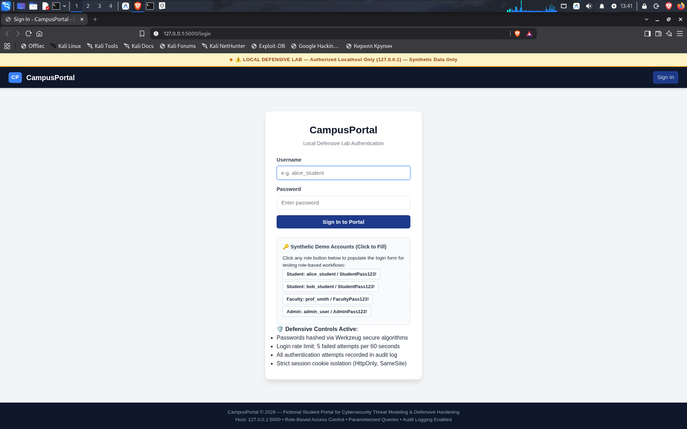
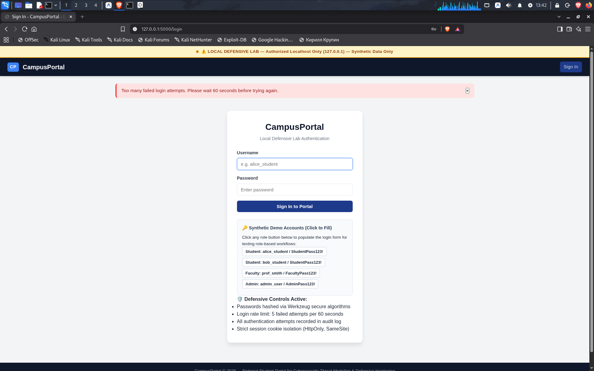
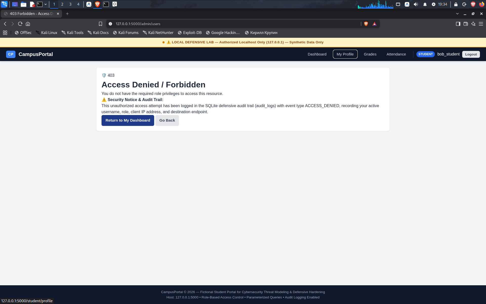
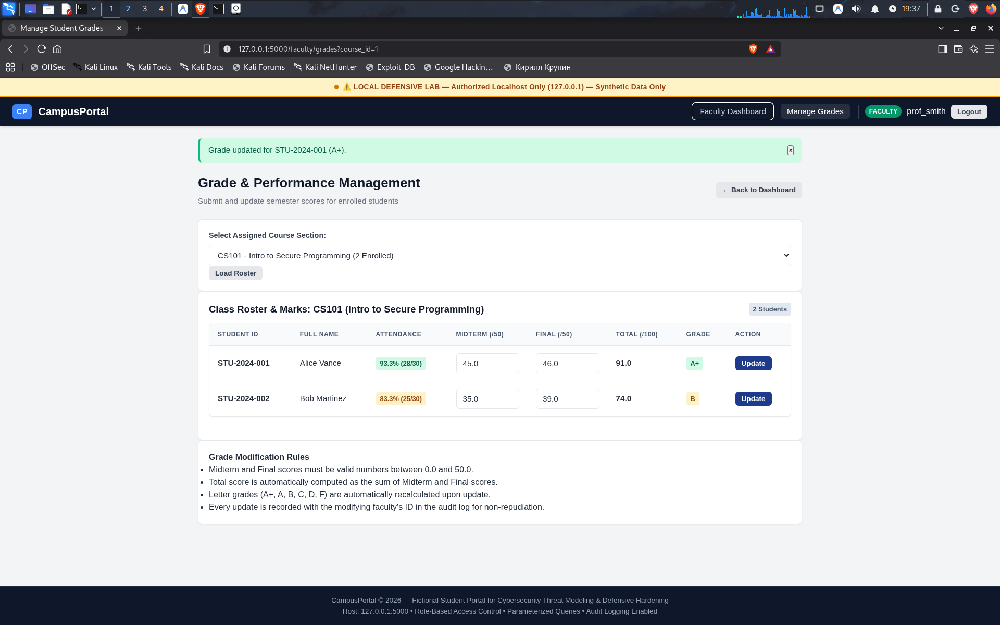
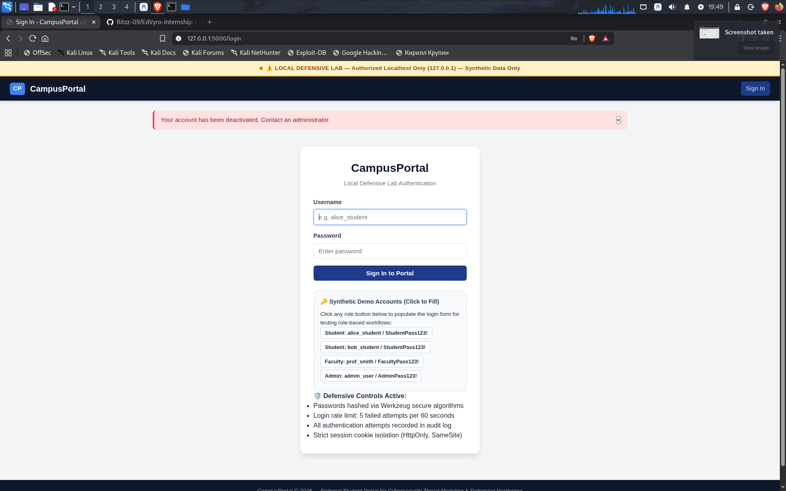
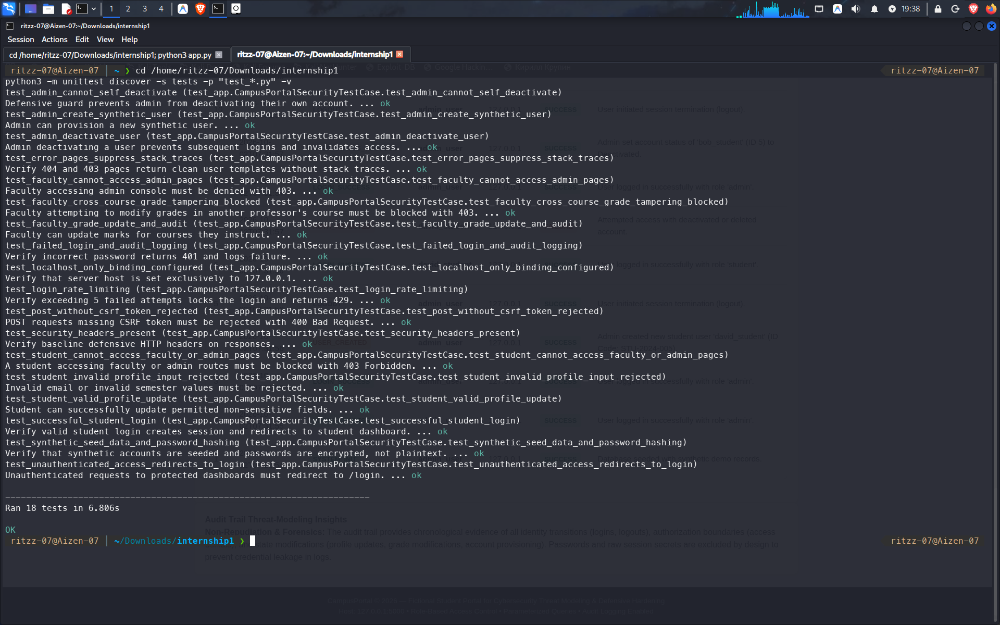

# 📸 Task 01: Security Verification & Evidence Log

> **Intern:** Ritzz (`@Ritzz-09`)  
> **Internship Track:** EdVyro Cybersecurity Internship  
> **Target Lab:** CampusPortal (Local Defensive Student Information System)  
> **Evaluation Objective:** Documenting photographic and empirical evidence of active security controls, authorization boundaries, rate-limiting thresholds, and forensic audit logging.

---

## 📋 Executive Verification Summary

To validate that CampusPortal behaves as a hardened defensive application rather than a vulnerable lab, I performed systematic manual and automated security tests across all three user roles (**Student**, **Faculty**, **Admin**).

Below is the summary index of the 9 empirical evidence items I captured during testing:

| Evidence ID | Security Domain | Target Endpoint / Action | Evidence File | Verified Behavior |
|:---:|:---|:---|:---|:---|
| **EV-01** | **Authentication & Scope** | `GET /login` | [`01_login_page_defensive_banner.png`](documentation/01_login_page_defensive_banner.png) | Mandatory localhost isolation banner, synthetic credential helper cards, and active baseline controls displayed. |
| **EV-02** | **Brute-Force Defense** | `POST /login` (5 Failures) | [`02_rate_limit_brute_force_429.png`](documentation/02_rate_limit_brute_force_429.png) | Sliding-window in-memory rate limiter throttled attempt #6, returning HTTP 429 and a 60-second cooldown warning. |
| **EV-03** | **Vertical Privilege Separation** | `GET /admin/users` as Student | [`03_rbac_student_blocked_403.png`](documentation/03_rbac_student_blocked_403.png) | Server-side `@roles_required('admin')` blocked student access, rendered custom 403 Forbidden, and logged `ACCESS_DENIED`. |
| **EV-04** | **Input Boundary Defense** | `GET /student/profile` | [`04_student_profile_boundary_defense.png`](documentation/04_student_profile_boundary_defense.png) | System identifiers (Student ID, Username, Role) are immutable; input validation confines edits strictly to non-sensitive contact fields. |
| **EV-05** | **Data Integrity & Ownership** | `POST /faculty/update-grade` | [`05_faculty_grade_update_cs101.png`](documentation/05_faculty_grade_update_cs101.png) | Instructor modified CS101 scores; system recalculated total score (91.0) and letter grade (A+) with an automated `GRADE_UPDATE` audit log. |
| **EV-06** | **Forensic Audit Trail** | `GET /admin/audit` | [`06_admin_audit_trail_non_repudiation.png`](documentation/06_admin_audit_trail_non_repudiation.png) | Real-time security telemetry recorded chronological lifecycle events (`LOGIN_SUCCESS`, `ACCESS_DENIED`, etc.) with **zero credentials leaked**. |
| **EV-07** | **Automated Test Suite** | Terminal: `python3 -m unittest` | [`07_automated_unit_tests_pass.png`](documentation/07_automated_unit_tests_pass.png) | 18 automated security unit tests passed 100% covering SQLi prevention, password hashing, and CSRF token enforcement. |
| **EV-08** | **Account Lifecycle (Deactivation)** | `POST /admin/toggle-user-status` | [`08_admin_user_deactivation.png`](documentation/08_admin_user_deactivation.png) | Admin successfully deactivated compromised user `bob_student`; status badge updated to red `Deactivated` in real time. |
| **EV-09** | **Session Revocation & Lockout** | `POST /login` (Deactivated User) | [`09_deactivated_account_login_blocked.png`](documentation/09_deactivated_account_login_blocked.png) | Server verified `is_active == 0`, immediately rejected login attempt with HTTP 403, and terminated any existing session. |

---

## 1. Evidence Item EV-01: Authentication & Localhost Isolation

### 1.1 Observation & My Testing Process:
I launched the Flask application locally on `127.0.0.1:5000` and opened the landing page in my browser. I verified that the application clearly communicates its authorized local defensive scope via the yellow persistent warning banner at the top of the interface.

* **Key Takeaway:** The interface provides synthetic demo accounts so evaluators can immediately test role transitions, while highlighting the defensive controls in place (password hashing, rate limiting, and cookie hardening).

---

## 2. Evidence Item EV-02: Brute-Force Rate Limiting (HTTP 429)

### 2.1 Observation & My Testing Process:
To test whether the application could withstand an automated dictionary or credential-stuffing attack, I clicked the `alice_student` demo user and deliberately submitted an incorrect password 5 consecutive times.

* **Observed Result:** On the 6th login attempt, the sliding-window rate limiter triggered. The application refused to perform CPU-intensive password hashing, immediately issued an **HTTP 429 (Too Many Requests)** status, and displayed:
  > *"Too many failed login attempts. Please wait 60 seconds before trying again."*
* **Audit Confirmation:** I verified in the SQLite database that a corresponding `LOGIN_RATE_LIMITED` security event was created.

---

## 3. Evidence Item EV-03: Role Separation & Access Control (RBAC)

### 3.1 Observation & My Testing Process:
I logged in as `bob_student` (a low-privilege student principal). To test for Broken Object Level Authorization (BOLA) and vertical privilege escalation, I manually modified my browser address bar to navigate directly to an administrative route: `http://127.0.0.1:5000/admin/users`.

* **Observed Result:** The server-side `@roles_required('admin')` decorator intercepted the request, checked Bob's role in the database session, and denied execution with a custom **403 Forbidden** page.
* **Security Insight:** Instead of leaking a Python stack trace or generic error, the custom error page clearly explained that the unauthorized attempt had been permanently recorded in the defensive audit trail.

---

## 4. Evidence Item EV-04: Student Profile Boundary Defense

### 4.1 Observation & My Testing Process:
While logged in as a student, I navigated to `/student/profile`. I inspected the form fields to ensure that sensitive institutional identifiers could not be altered through parameter tampering.

* **Observed Result:** As shown below, **Username**, **Student ID Code**, **Full Name**, and **Account Role** are strictly disabled and read-only.
* **Defense-in-Depth:** In the backend `app.py`, the update query uses parameterized SQL strictly restricted to the whitelist columns (`email`, `phone`, `department`, `semester`). Even if an attacker manually injects `role=admin` via a POST request, the backend drops the field.

---

## 5. Evidence Item EV-05: Faculty Grade Modification & Ownership Check

### 5.1 Observation & My Testing Process:
I logged in as `prof_smith` (Faculty role) and selected assigned course `CS101 (Intro to Secure Programming)`. I adjusted student Alice Vance's midterm score to `45.0` and submitted the form.

* **Observed Result:** The backend validated that the score was within bounds (0.0 to 50.0), updated the database via parameterized SQL, recalculated the cumulative score to `91.0`, and assigned an `A+` grade badge.
* **IDOR Defense:** I verified in the codebase that the update route verifies `courses.faculty_id == session.faculty_id`, preventing instructors from tampering with courses taught by other faculty members.

---

## 6. Evidence Item EV-06: Forensic Audit Trail & Accountability

### 6.1 Observation & My Testing Process:
I logged in as `admin_user` and navigated to `/admin/audit`. I reviewed the live audit log table to confirm that all earlier testing activities had been captured chronologically.

* **Observed Result:** The audit trail displayed a detailed record of every security-relevant event:
  - `LOGIN_SUCCESS` (Legitimate logins)
  - `LOGIN_RATE_LIMITED` (My brute-force simulation from EV-02)
  - `ACCESS_DENIED` (Bob's attempted escalation to `/admin/users` from EV-03)
  - `GRADE_UPDATE` (Prof. Smith's score alteration from EV-05)
* **Privacy & Security Control:** I verified the `Event Details` column to ensure that **passwords, tokens, and raw session secrets are completely excluded** from logs.

---

## Evidence Item EV-08: Account Lifecycle & Deactivation

**Screenshot:** `documentation/08_admin_user_deactivation.png`

This evidence demonstrates the administrative account lifecycle control. An administrator can deactivate a user account through the authorized admin interface. The action is recorded in the application audit log.

---

## Evidence Item EV-09: Deactivated Account Login Prevention

**Screenshot:** `documentation/09_deactivated_account_login_blocked.png`

This evidence demonstrates session and authentication enforcement after account deactivation. A deactivated account is prevented from establishing a new authenticated session.

---

## Evidence Item EV-07: Automated Unit Test Suite Execution

**Screenshot:** `documentation/07_automated_unit_tests_pass.png`

This evidence demonstrates the automated security regression test suite. All 18 automated tests completed successfully, providing verification coverage for authentication, authorization, CSRF protection, rate limiting, input validation, account lifecycle controls, and related security behavior.

