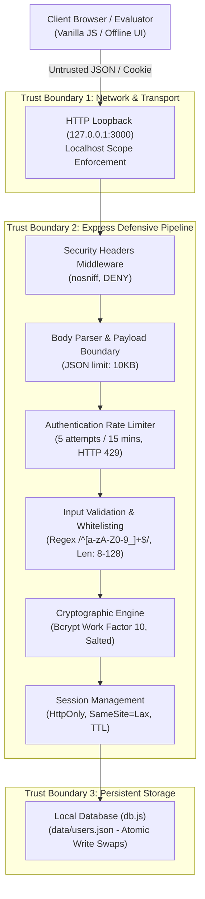
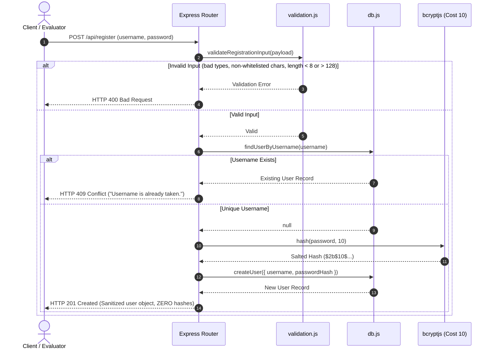
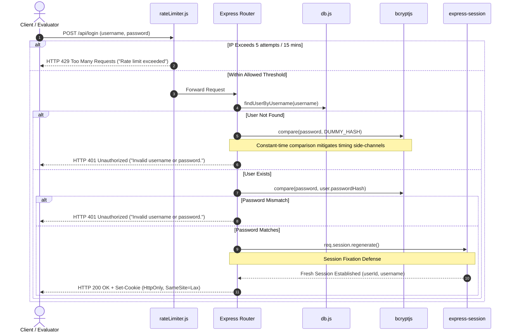
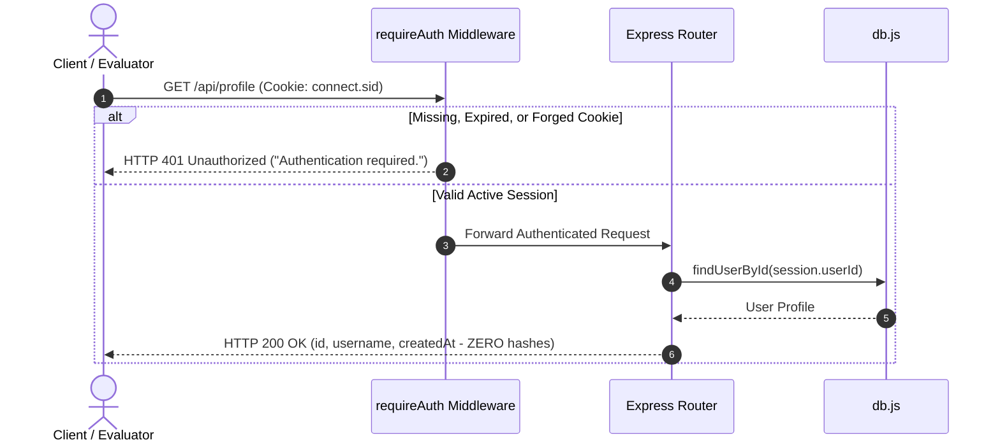

# 📐 Task 02: Secure Authentication Lab — Architecture & System Design

> **Intern:** Ritzz (`@Ritzz-09`)  
> **Internship Track:** EdVyro Cybersecurity Internship  
> **Target Lab:** SecureAuth (Defensive Local Authentication Service)  
> **Format:** Hybrid Architectural Narrative & Mermaid Diagram Decomposition

---

## 1. Architectural Philosophy & Design Principles

When designing **SecureAuth**, I operated under the core defensive engineering principle: **Assume Breach & Enforce Defense-in-Depth**. Rather than relying on a single security perimeter, defenses are distributed across every layer of the request lifecycle—from network transport and payload parsing to cryptographic derivation and session lifecycle termination.

### 1.1 Why Node.js & Express for this Microservice?
- **Asynchronous Non-Blocking I/O:** Ideal for lightweight authentication routing where I/O operations (reading databases, validating session stores) must not block concurrent client connections.
- **Pure JavaScript Cryptography (`bcryptjs`):** Avoids native C++ compilation bindings that frequently break across varied evaluation environments, while providing standard salted adaptive hashing.
- **Middleware Modularity:** Express enables a strictly ordered defensive middleware chain where input parsing, rate limiting, and defensive response headers execute *before* any business logic or cryptographic functions are invoked.

### 1.2 Storage Architecture & Atomic File Synchronization
- **Selection:** A custom abstraction layer [`src/db.js`](./src/db.js) managing local JSON persistence (`data/users.json`).
- **Resilience Trade-Off:** Traditional database engines (PostgreSQL, MySQL) introduce external service dependencies that can fail during local evaluation. SQLite requires native binary drivers. 
- **Atomic Write Mechanism:** To prevent file corruption during sudden server crashes or concurrent registration attempts, `db.createUser()` writes new user records to a temporary file (`users.json.<timestamp>.tmp`) and performs an atomic filesystem swap via `fs.renameSync()`.

---

## 2. High-Level System Architecture & Trust Boundaries

The system enforces three distinct trust boundaries, treating all data originating outside the Express runtime as untrusted:

---

## 3. Sequence Flows & Request Lifecycles

### 3.1 Registration Sequence Flow (`POST /api/register`)

---

### 3.2 Login & Session Establishment (`POST /api/login`)

---

### 3.3 Protected Route Access (`GET /api/profile`)

---

## 4. Session Security Architecture

| Security Property | Implementation Configuration | Defensive Objective |
|:---|:---|:---|
| **Cookie Name** | `connect.sid` | Standard identifier without leaking framework internals. |
| **HttpOnly** | `httpOnly: true` | Prohibits client-side JavaScript execution (`document.cookie`) from reading session tokens (XSS defense). |
| **SameSite Policy** | `sameSite: 'lax'` | Restricts cross-site dispatching, defending against Cross-Site Request Forgery (CSRF). |
| **Transport Security** | `secure: process.env.NODE_ENV === 'production'` | Dynamically enables HTTPS-only transmission in production while supporting functional localhost testing. |
| **Session Lifetime** | `maxAge: 15 * 60 * 1000` (15 minutes) | Automatic idle invalidation preventing zombie sessions on unattended workstations. |
| **Anti-Fixation** | `req.session.regenerate()` | Discards pre-login session IDs and generates a new token upon successful authentication. |
| **Explicit Revocation** | `req.session.destroy()` + `res.clearCookie()` | Completely purges server-side session state upon user logout. |
