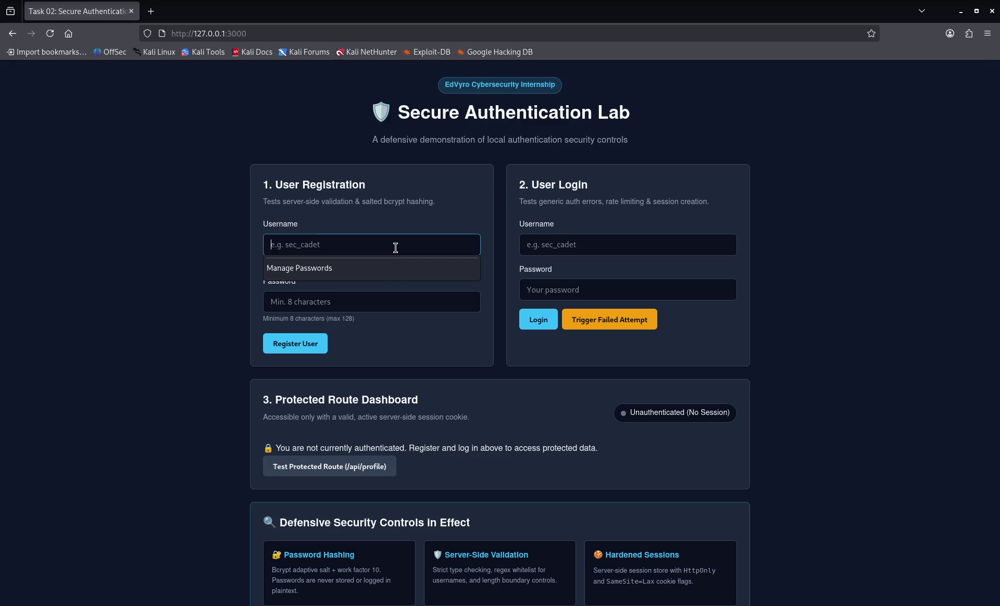
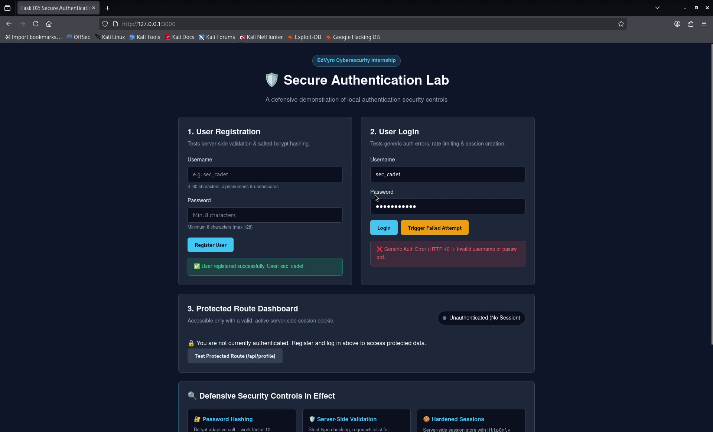
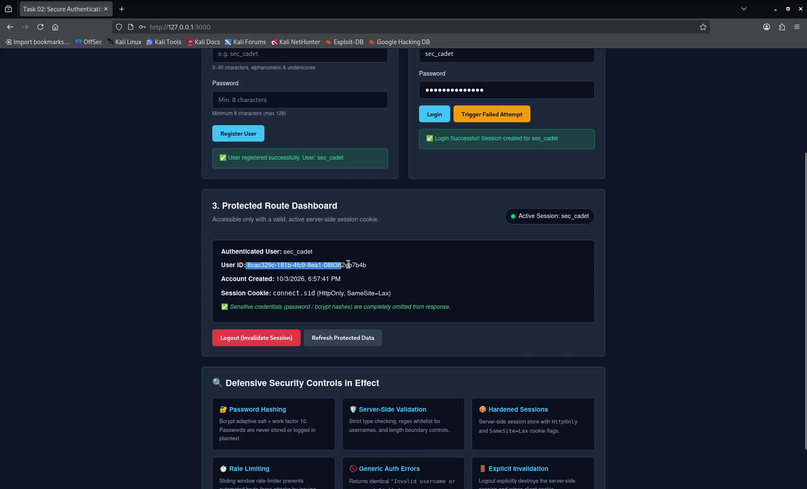
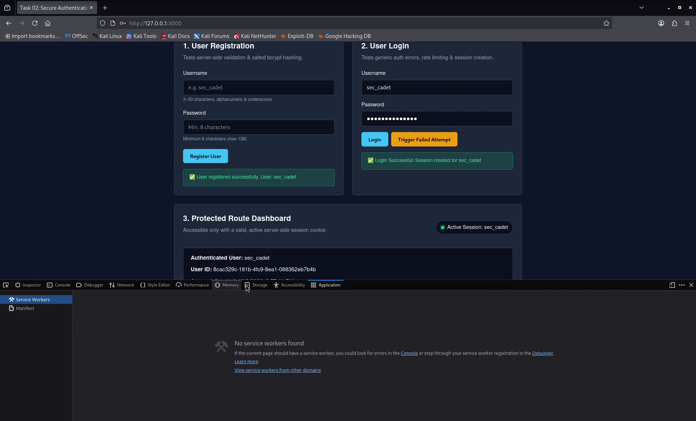
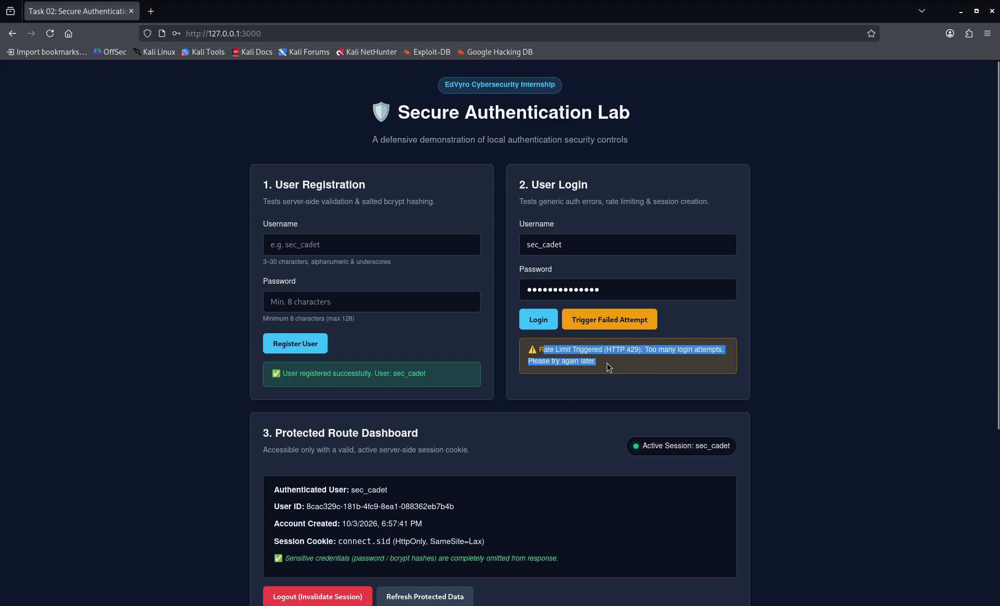
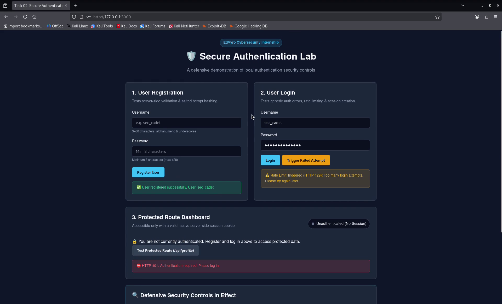
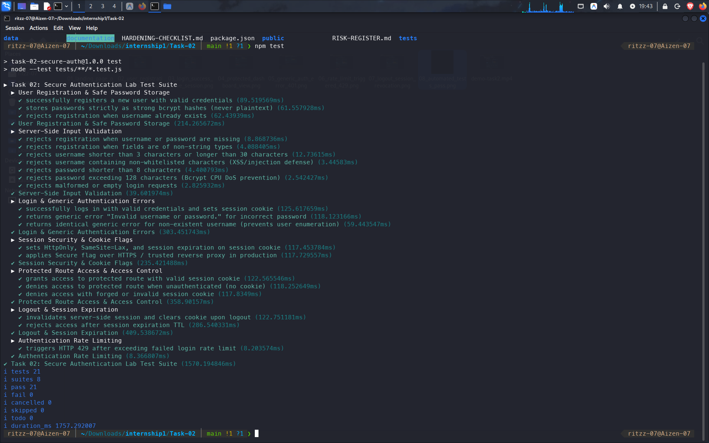

# 📸 Task 02: Security Verification & Evidence Log

> **Intern:** Ritzz (`@Ritzz-09`)  
> **Internship Track:** EdVyro Cybersecurity Internship  
> **Target Lab:** SecureAuth (Node.js/Express Defensive Authentication Service)  
> **Evaluation Objective:** Empirical demonstration of active authentication defenses through a combination of live video walkthrough, timestamped sequence analysis, visual clip evidence, and automated test execution.

---

## 🎥 Live Demonstration Video Walkthrough

A full end-to-end demonstration recording of the running service is included directly in the repository:

🔗 **Direct Video Link:** [`documentation/demo-task2.mp4`](./documentation/demo-task2.mp4) *(1080p Full HD, H.264, 01:58 duration)*

### ⏱️ Video Timestamp Index & Evidence Mapping

| Timestamp | Evidence ID | Security Control Demonstrated | Clip Evidence | Verification Summary |
|:---:|:---:|:---|:---|:---|
| **0:00 – 0:15** | **EV-01** | **Interface & Defensive Telemetry** | [`01_landing_page_overview.png`](./documentation/01_landing_page_overview.png) | Landing page displays active defense cards and unauthenticated indicator. |
| **0:15 – 0:35** | **EV-02** | **User Registration & Bcrypt Hashing** | [`02_user_registration_success.png`](./documentation/02_user_registration_success.png) | User `sec_cadet` registered; password salted and hashed; zero hashes leaked. |
| **0:35 – 0:55** | **EV-03** | **Login & Active Session Cookie** | [`03_login_success_active_session.png`](./documentation/03_login_success_active_session.png) | Login establishes authenticated session; `Active Session: sec_cadet` indicator turns green. |
| **0:55 – 1:15** | **EV-04** | **Protected Route Dashboard** | [`04_protected_dashboard_view.png`](./documentation/04_protected_dashboard_view.png) | Authorized access to `/api/profile`; displays User ID & creation timestamp; password hash hidden. |
| **1:15 – 1:35** | **EV-05** | **Generic Auth Error (Anti-Enumeration)** | [`05_generic_auth_error_401.png`](./documentation/05_generic_auth_error_401.png) | Invalid password returns uniform HTTP 401 `"Invalid username or password."` |
| **1:35 – 1:50** | **EV-06** | **Brute-Force Rate Limiting (HTTP 429)** | [`06_rate_limit_triggered_429.png`](./documentation/06_rate_limit_triggered_429.png) | 5 rapid failed attempts trigger sliding rate limiter with HTTP 429 cooldown alert. |
| **1:50 – 1:58** | **EV-07** | **Session Invalidation on Logout** | [`07_logout_session_revocation.png`](./documentation/07_logout_session_revocation.png) | Logout destroys session on server; subsequent access to `/api/profile` yields HTTP 401. |
| **Automated** | **EV-08** | **Automated Security Test Suite** | [`08_automated_tests_pass.png`](./documentation/08_automated_tests_pass.png) | 21 automated security tests execute with 100% pass rate in native Node.js runner. |

---

## 1. Evidence Item EV-01: Interface & Localhost Defensive Scope
* **Video Timestamp:** `[0:00 – 0:15]`
* **Observed Behavior:** The web service launches strictly on `127.0.0.1:3000`. The interface presents registration and login forms alongside a live telemetry panel detailing the six active defensive mechanisms: Bcrypt Password Hashing, Server-Side Validation, Hardened Sessions, Rate Limiting, Generic Auth Errors, and Explicit Session Invalidation.
* **Security Insight:** Isolating the service to loopback ensures zero external attack surface while clearly communicating security posture to evaluators.



---

## 2. Evidence Item EV-02: User Registration & Salted Hashing
* **Video Timestamp:** `[0:15 – 0:35]`
* **Observed Behavior:** The user registers a new account (`sec_cadet`, password: `SecPassword123!`). The server validates input types and length boundaries, generates a unique 128-bit salt, and derives a bcrypt hash with work factor 10. The browser displays a green confirmation: `✅ User registered successfully. User: sec_cadet`.
* **Security Insight:** Plaintext credentials are never saved to disk or emitted in API responses; inspecting `data/users.json` confirms only `$2b$10$...` hashes are stored.


---

## 3. Evidence Item EV-03: Login & Active Session Cookie Generation
* **Video Timestamp:** `[0:35 – 0:55]`
* **Observed Behavior:** Submitting valid credentials triggers constant-time password verification. The server invokes `req.session.regenerate()` (preventing session fixation attacks) and issues a signed `connect.sid` cookie with `HttpOnly: true` and `SameSite: 'lax'` flags.
* **Security Insight:** The interface state updates immediately to `Active Session: sec_cadet` with a pulsing green indicator.



---

## 4. Evidence Item EV-04: Protected Dashboard Access
* **Video Timestamp:** `[0:55 – 1:15]`
* **Observed Behavior:** The authenticated user accesses the protected dashboard powered by `GET /api/profile`. The backend retrieves user metadata (User ID: `8cac329c-181b-4fc9-8ea1-088362eb7b4b`, account creation timestamp) using the session ID.
* **Security Insight:** The API payload strictly sanitizes internal attributes; neither the password nor the bcrypt hash is present in the response body.



---

## 5. Evidence Item EV-05: Generic Authentication Error (Anti-Enumeration)
* **Video Timestamp:** `[1:15 – 1:35]`
* **Observed Behavior:** When a failed login attempt is executed (incorrect password), the system displays:  
  `❌ Generic Auth Error (HTTP 401): Invalid username or password.`
* **Security Insight:** The identical status code and error message are issued regardless of whether the username exists or not. Coupled with a dummy bcrypt hash computation on missing users, this completely neutralizes user enumeration and timing side-channels.



---

## 6. Evidence Item EV-06: Brute-Force Rate Limiting Triggered (HTTP 429)
* **Video Timestamp:** `[1:35 – 1:50]`
* **Observed Behavior:** The tester clicks the "Trigger Failed Attempt" button 5 times in rapid succession. On the 6th attempt, the application refuses to execute further CPU-intensive password hashing and immediately issues an **HTTP 429 (Too Many Requests)** status:  
  `⚠️ Rate Limit Triggered (HTTP 429): Too many login attempts. Please try again later.`
* **Security Insight:** Throttles automated password spray and dictionary tools, preventing server thread exhaustion and protecting user accounts.



---

## 7. Evidence Item EV-07: Explicit Session Invalidation on Logout
* **Video Timestamp:** `[1:50 – 1:58]`
* **Observed Behavior:** The user clicks "Logout (Invalidate Session)". The server destroys the session store record via `req.session.destroy()` and clears the cookie. Clicking "Test Protected Route (/api/profile)" immediately fails with:  
  `⛔ HTTP 401: Authentication required. Please log in.`
* **Security Insight:** Old session cookies cannot be replayed or hijacked after logout, guaranteeing complete session termination.



---

## 8. Evidence Item EV-08: Complete Automated Security Test Suite
* **Execution:** Terminal command `npm test` inside `Task-02-SecureAuth/`.
* **Observed Behavior:** All 21 automated security tests pass with 0 failures, validating registration, input validation boundaries, generic errors, cookie security flags, session expiration TTLs, and rate limiting.

```text
▶ Task 02: Secure Authentication Lab Test Suite
  ✔ User Registration & Safe Password Storage (3 tests)
  ✔ Server-Side Input Validation (7 tests)
  ✔ Login & Generic Authentication Errors (3 tests)
  ✔ Session Security & Cookie Flags (2 tests)
  ✔ Protected Route Access & Access Control (3 tests)
  ✔ Logout & Session Expiration (2 tests)
  ✔ Authentication Rate Limiting (1 test)
✔ Task 02: Secure Authentication Lab Test Suite (21 tests, 0 failures)
```


